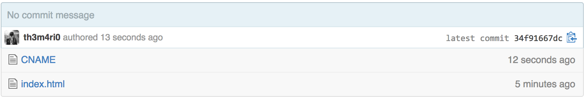
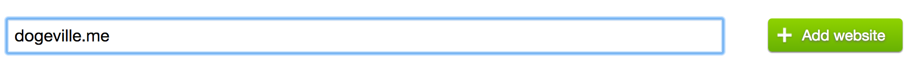
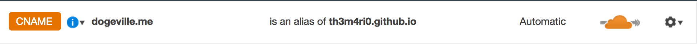
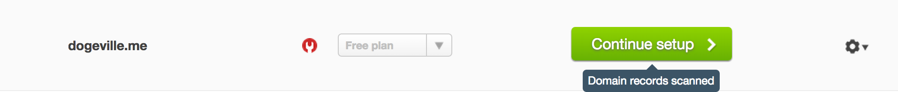
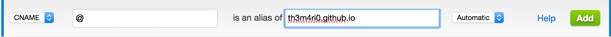
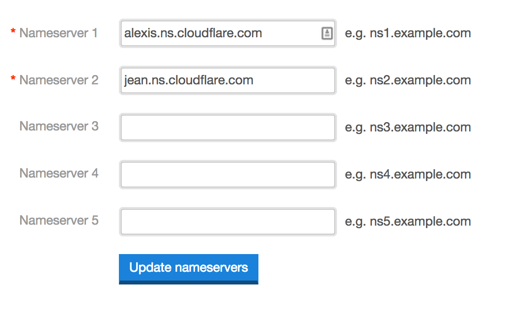
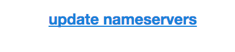

# Almost free website  

## Comment avoir votre tout petit site en ligne pour ~15$/an  

N.B. Remplacer tous les endroits où est inscrit ```dogeville.me``` par votre nom de domaine.

### Création des comptes

1. Créer un compte Github : [https://github.com/join](https://github.com/join)
2. Créer un compte Cloudflare : [https://www.cloudflare.com/sign-up](https://www.cloudflare.com/sign-up)
3. Acheter ou transférer votre nom de domaine chez [iwantmyname](http://iwantmyname.com) (ou tout autre registrar)

### Setup du site

#### Sur Github :  
4. Créer un repository nommé suivant la structure suivante : ```th3m4ri0.github.io``` (remplacer ```th3m4ri0``` par votre pseudo)
5. Ajouter le contenu de votre site au repository :

6. Ajouter un fichier nommé CNAME avec le contenu suivant :
```dogeville.me``` (ou votre nom de domaine)   


#### Sur Cloudflare :  
7. Ajouter l'adresse de votre nom de domaine :

8. Laisser le scan s'effectuer :
  

9. Puis entrez la ligne suivante dans les DNS records :


(remplacez ```th3m4ri0``` par votre pseudo github)
10. Sauvegardez les entrées.
11. Copiez les deux lignes en haut à droite de la page :


#### Sur iwantmyname (ou votre fournisseur de nom de domaine)
12. Rendez-vous sur la page d'information de votre domaine (généralement dans [http://iwantmyname.com/dashboard/domains/](http://iwantmyname.com/dashboard/domains/)) et cliquez sur Update nameservers :

13. Puis collez les lignes copiées 2 étapes plus haut :

14. Sauvegardez
15. Ouvrez votre navigateur à l'adresse de votre domaine ! Vous devriez voir votre site apparaitre.