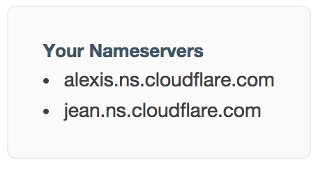

# Almost free website  

## How to get a small website online for ~$15 a year

[__:fr: Version en français ici__](README.fr.md)

You can get a free .me domain if you are a student at the following URL: [http://nc.me](http://nc.me)

N.B.: __Everywhere you see ```dogeville.me```, use your own domain.__

### Signing up on different services

1. Create a Github account: [https://github.com/join](https://github.com/join)
2. Create a Cloudflare account: [https://www.cloudflare.com/sign-up](https://www.cloudflare.com/sign-up)
3. Buy or transfer your domain to [iwantmyname](http://iwantmyname.com) (or any other registrar)

### Setting up

#### On Github:  
4. Create a repository named as follows: ```th3m4ri0.github.io``` (remplace ```th3m4ri0``` with your own username)
5. Commit your files to your repository:

6. Add a file named ``CNAME`` with the following content:
```dogeville.me``` (or your own domain)   


#### On Cloudflare:  
7. Add your domain URL:

8. Let Cloudflare do its scanning stuff:
  

9. Add the following line to the DNS records:


(replace ```th3m4ri0``` with your own github username)
10. Save.
11. Copy the two lines at the top right of the page:


#### On iwantmyname (or your own registrar):
12. Go to your domain's information page (generally in [http://iwantmyname.com/dashboard/domains/](http://iwantmyname.com/dashboard/domains/)) and click on Update Nameservers:

13. Paste the 2 lines you copied two steps earlier:

14. Save.
15. Open your browser at your domain URL! You should be seeing your website.